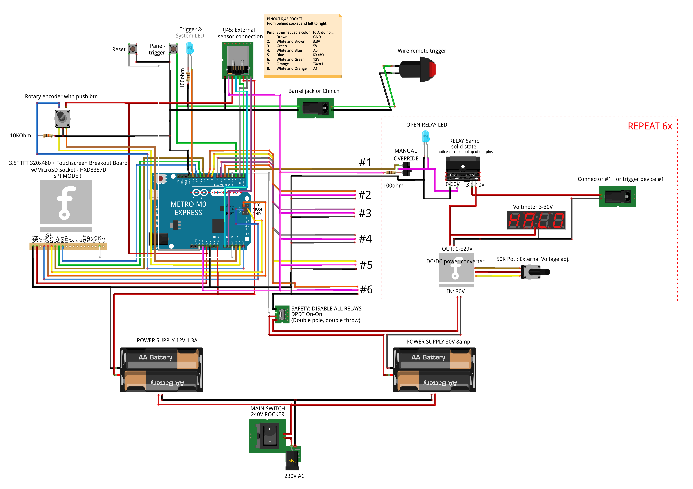

# triggerbox

## Introduction

This system allows for triggering up to six relays in a specific, as precice-as-possible rhythm.
It is designed for **high speed photography** or **high speed cinema shootings**,
where it can release water droplets, trigger explosions, activate a solenoid or anything that can be started with **up to 30VDC**.

Each relay can be tuned to start and stop being closed, starting when a button is pushed.
As in my hardware setup, each relay can hold up to **30VDC @ 5amps** and is able to trigger any external DC powered motor, electro magnet, or the like.

There is a 320x480 TFT display necessary to display a graphical menu, and give some feedback to the user. This can be omitted if you'd like to implement serial communication controls for user input.

The accuracy of the timing has to be determined. Theoretically you can set on / off timestamps in a microsecond fashion (0.000001s), but this is heavily influenced by the programs efficiency, the relay reaction time and the microcontrollers speed itself. More important than the preciseness to your entered timestamps though is the **repeatability**. If you do not change the hardware, the system should always trigger the relays with about the same lag, leading to the same results each time.

This system can be triggered with a regular hardwired push button. You are able to extend the triggering to another system: Connect it to your camera flash system, wire to two metal connectors, or use another arduino.

Maximum delay of any trigger is 35.79mins, theoretical minimum duration 0.000001s (1 microsecond, depending on the speed of the relays used).

## Hardware

This project needs eg. an Adafruit Metro M0 Express to work properly. Its program size and the demands for speed exceeds the capabilities of an Arduino UNO or Leonardo.

## Schematic

### Hardware list

- Metro M0 Express - https://www.adafruit.com/product/3505
- TFT Touchscreen Breakout Board - HXD8357D - https://www.adafruit.com/product/2050
- 6pcs Solid state relays - https://www.digikey.ch/product-detail/en/sensata-crydom/CMX60D5/CC1667-ND/751911
- 30VDC power supply 8amp - https://www.components-store.com/product/MEAN-WELL/SP-240-30.html
- 5VDC power supply 5amp - https://www.components-store.com/product/MEAN-WELL/RS-25-5.html
- Generic rotary encoder
- Generic push button
- Some generic resistors
- Generic AC cold appliance socket

### Optional hardware
- 7pcs generic LEDs (display relay action)
- 6pcs DC/DC 15A Buck Adjustable 4-32V 12V to 1.2-32V 5V Converter Step Down Module DT (adjustment of relay voltage) - https://ebay.us/CVko1q
- 6pcs Generic 50KΩ potentiometer (allow for free placement of potentiometer of the Step Down Module)
- 6pcs LED Digital Voltmeter 0-100V (display chosen voltage) - https://de.aliexpress.com/item/33017235960.html?spm=a2g0s.9042311.0.0.64224c4dII9GZf

Keep an eye on the fact that your solid state relay can switch loads from ***0VDC*** to 30VDC.
Cheaper relays may only trigger loads from eg. ***14VDC*** to 30VDC, which may also work for your use case.

## Attention: Electricity

Although this setup allows for each relay to hold **5amps**, the sum of active loads in parallel **cannot be greater than 8 amps**.
The bottleneck is the 30VDC power supply with only 8amps. If you choose something beefier, you can trigger more loads @ 5amps in parallel.

Also, this system handles ***mains voltage***. No fingers where they do not belong. Its components are chosen based on a 230V AC/DC environment.
